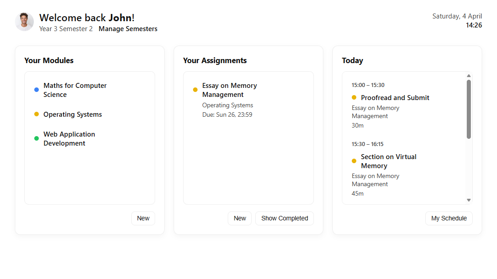
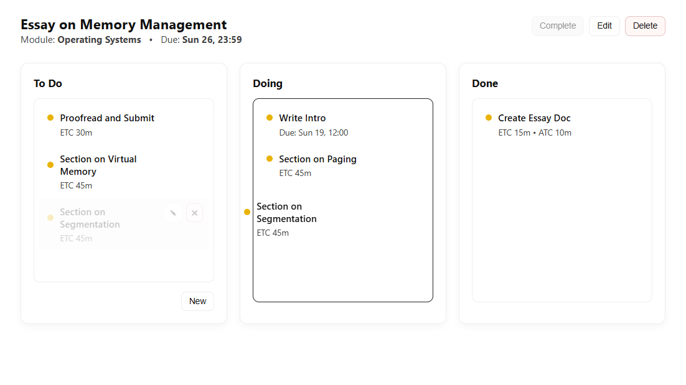
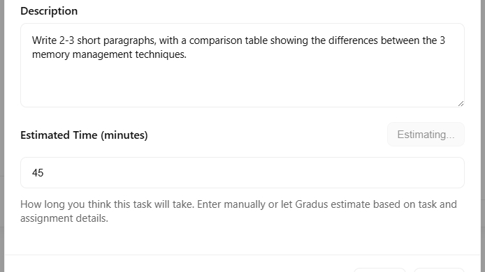
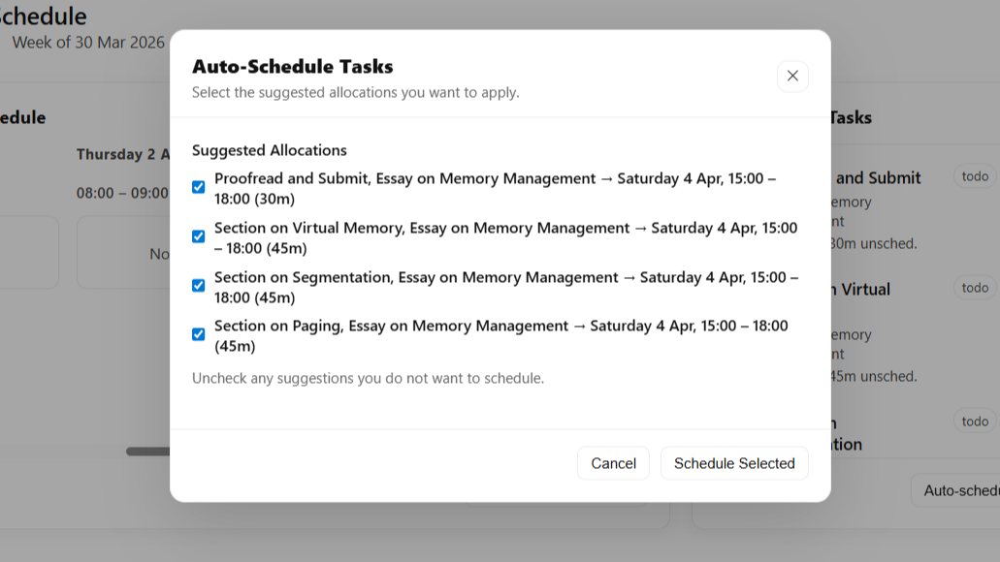

# Gradus

> **An intelligent student planner that helps students organise their academic workload with AI-assisted task duration estimation, auto-scheduling, and progress tracking.**


---

## Overview

Gradus is a full-stack web application developed as a final-year software engineering project. It was designed to help students better manage their academic lives by combining: 

- a Kanban workflow element to break down and manage assignment tasks,
- an AI element to estimate how long each individual task should take based on user-supplied information such as the task name, description, and perceived difficulty,
- and a scheduling element to assign the tasks into the user's predetermined study sessions.


Instead of manually deciding how much time to dedicate to an assignment and when to schedule it, Gradus assists with **capturing, planning, and scheduling**, allowing students to focus on completing their work rather than organising it.

The goal of the project is to reduce academic stress, improve time management, and encourage consistent study habits.

---

## Features

### Academic Planning

- Semester and module management
- Assignment task management
- Kanban boards
- AI-assisted task duration estimates
- Deadline tracking

### Scheduling

- Manage study sessions
- Schedule tasks into study sessions
- Auto-schedule tasks
- Partial scheduling

### Statistics

- Numerical statistics
- Analytics charts
- Insights

### User Accounts

- Secure authentication
- Personal dashboard
- Light and dark themes
- Avatar uploads
- Password resets

### Security

- IP rate limiting
- User account rate limiting
- Two-step verification
- Login timeouts and lockouts


### Maintenance

- Structured JSON logging
- Maintenance mode
- Centralised error handling
- Unit tests

---

## Tech Stack

### Frontend

- HTML5
- CSS3
- JavaScript
- EJS

### Backend

- Node.js
- Express.js

### Database

- MySQL

### AI

- OpenAI API

### Other Technologies

- Express Session
- bcrypt
- Express Rate Limit
- Nodemailer

---

## Architecture

```
               Browser
                  │
                  ▼
        Express.js Application
          ┌───────┴────────┐
          ▼                ▼
   MySQL Database     OpenAI API
```

---

## Screenshots

| Dashboard | Assignment View | AI Estimation | Auto-Scheduling |
|-----------|----------|----------|----------|
|  |  |  |  |

---

## Project Structure

```
Gradus
│
├── database/
├── middleware/
├── modules/
├── public/
├── routes/
├── storage/
│   ├── avatars/
│   └── logs/
│
├── package.json
├── index.js
├── .env
│
└── README.md
```

---

## Getting Started

### Prerequisites

- Node.js
- MySQL Server
- OpenAI API key

### Installation

Clone the repository

```bash
git clone https://github.com/MimixSoftware/Gradus.git
```

Navigate into the project

```bash
cd Gradus
```

Install packages

```bash
npm install
```

Create a new file in the root directory: 

```
.env
```

Configure application environment variables: 

```json
PORT=3000
PRODUCTION=false
URL=http://localhost:3000
MAINTENANCE_MODE=false
```

Configure database environment variables: 

```json
DB_HOST=localhost
DB_PORT=
DB_USER=
DB_PASSWORD=
DB_NAME=gradus
```

Configure security environment variables: 

```json
SESSION_SECRET=
BCRYPT_SALT_ROUNDS=
```

Configure OpenRouter API environment variables:  

```json
OPENROUTER_API_KEY=
OPENROUTER_MODEL=anthropic/claude-sonnet-4.6
OPENROUTER_SITE_URL=https://gradus.tools
OPENROUTER_APP_NAME=Gradus
```

Configure email (SMTP) environment variables:  

```json
SMTP_HOST=
SMTP_PORT=
SMTP_SECURE=
SMTP_USER=
SMTP_PASS=
EMAIL_FROM=
```

Configure verification and password reset environment variables:  

```json
VERIFICATION_CODE_EXPIRATION_MINUTES=
MAX_VERIFICATION_ATTEMPTS=

RESET_TOKEN_EXPIRATION_MINUTES=

RESEND_COOLDOWN_SECONDS=
MAX_RESEND_COUNT=
RESEND_LOCK_HOURS=
```

Configure login protection environment variables: 

```json
MAX_FAILED_LOGIN_ATTEMPTS=
LOGIN_COOLDOWN_SECONDS=
```

Configure logging environment variable: 

```json
#DEBUG/INFO/WARN/ERROR
LOG_LEVEL=
```

Start the application

```bash
node index.js
```

To run unit tests: 

```bash
npm test
```

---

## Future Improvements

- Mobile app
- Daily Digest emails
- AI-assisted assignment breakdown
- Scope expansion from student planner to student tool platform

---

## Goals

- Help students organise academic work
- Improve time management
- Reduce workload stress
- Encourage consistent study habits

---

## Author

**Mimix Software**

© 2026
